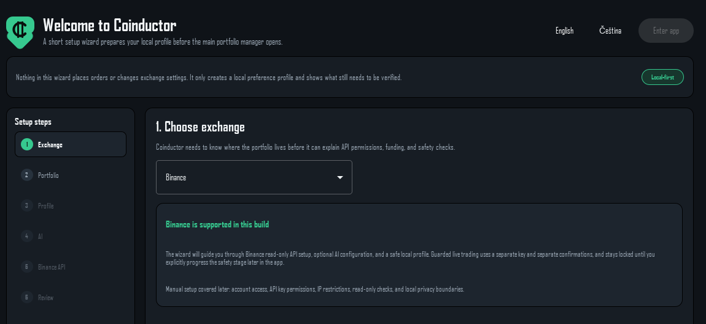

# Coinductor

**Knowing *when* to act is the hard part of crypto. Coinductor works it out for you — and
never acts without your say-so.**

An open-source **Binance Spot portfolio assistant** for **Windows**, running entirely on
your own machine. Deterministic risk engine, optional **local LLM** (Ollama or any
OpenAI-compatible endpoint), no account, no telemetry, and no automatic trading.

[](https://github.com/cakla97/coinductor/releases/latest)
[](LICENSE)
[](pyproject.toml)
[](#install)
[](#where-your-data-lives)

[**Install**](#install) · [First run](#first-run) · [Automation](#automation) ·
[What it will not do](#what-it-will-not-do) ·
[Where your data lives](#where-your-data-lives) · [Documentation](#documentation) ·
[**Support the project**](#support-the-project) · [Security](SECURITY.md) · [License](#license)

> **Not financial advice.** Coinductor is a personal portfolio tool. You are responsible for
> every order that reaches your exchange account, including ones you confirmed through it.



Most people who want to hold crypto get stuck in the same place. Either they have never
bought any and have no idea what a sensible first portfolio looks like, or they already
hold a few coins and have no idea what to do next. Both end up doing nothing, or acting on
a hunch at the worst possible moment.

Coinductor is a desktop app that sits between those two. It reads your Binance account,
runs a deterministic analysis over it, and tells you plainly what it would do and why —
buy, hold, rebalance, set up a Grid bot, or nothing at all. You decide how far it goes:
recommendations only, or guarded automation where it prepares the order and you confirm it.

## Who it is for

### Starting from zero

Tell it your budget and how much risk you can live with. It proposes a first basket sized
to that budget, in tranches rather than one nervous lump sum, and explains every allocation.
From there the same analysis keeps running, so your first portfolio does not become a
forgotten one.

### Already holding

It classifies what you own — core, stable, protected, dust — and looks for the next
sensible move: rebalancing drift, a range worth running a Grid bot on, idle stablecoins that
could be earning. Your protected assets stay protected; it will tell you it cannot fund
something rather than quietly sell your BTC to do it.

### If you do not trust your own timing

That is the point. The decision to buy runs through a fixed set of checks — trend, EMA200,
RSI band, loss limits, position caps — that do not change because the chart looks exciting.
An AI model can propose; only deterministic code can approve. And nothing reaches your
exchange account until you have unlocked it in stages and typed a confirmation for that
specific action.

How *much* it would buy is decided the same way. The size is the smallest of what you allow
as a share of your portfolio, what the risk limits permit, and what your account can
actually pay — so the same settings behave sensibly whether you hold 500 or 50,000, and an
order is never proposed at a size the balance cannot fund.

Everything runs on your machine: keys in the operating system's credential store, history in
a local SQLite file, nothing uploaded anywhere.

## What it will not do

This is the part worth reading before installing anything that touches an exchange account.

- **It cannot withdraw funds.** The read-only key it asks for first is rejected if it has
  trading, withdrawal, transfer, margin or futures permissions enabled.
- **It cannot place an order on its own.** Live submission requires all of: the safety stage
  raised to `LIVE_ENABLED` by hand, an automation level of *Guarded automation* in your
  profile, verified live-key permissions, and a typed confirmation phrase — per action.
  That last one is what makes a scheduled run safe: no timer can type it.
- **No futures, no margin, no leverage.** Spot and Simple Earn Flexible only; Locked Earn is
  read-only.
- **The AI never decides anything.** It proposes; deterministic code disposes. See
  [the invariant](#the-invariant) below.
- **It is not a 24/7 bot.** The analysis can run on a schedule — see
  [Automation](#automation) — but every order still waits for you, and nothing runs while
  your machine is off. There is no server doing this on your behalf, which is the same
  reason there is no account and no telemetry.

## What to expect from the AI

**The AI is optional and it decides nothing.** Every number, verdict and blocker on the
Action Plan comes from the deterministic analysis, which never consults a model. The AI adds
a commentary, an alternative trade opinion, and a chat that can explain the app. Turning it
off costs you none of the analysis.

That matters because **a local model will sometimes produce nothing useful**, and this is
normal rather than a fault:

- It may answer in the wrong shape and the commentary comes back empty. Coinductor asks for
  a specific JSON structure; smaller models drift from it. You will see "AI commentary
  returned no summary" — the run itself is unaffected.
- It may answer in English even when the app is in your language. The request asks for your
  language; a model is free to ignore it.
- Its trade opinion may be discarded. If it proposes something the risk engine rejects, the
  deterministic analyst decides instead and the card says so.

**Model size is the main lever.** For portfolio commentary, 14B-class models are the
practical minimum; anything smaller is best treated as help with using the app rather than
as market reasoning. A cloud provider is markedly more reliable at following the requested
format — at the cost of sending the prompt off your machine.

None of the above can affect what an order does. The model cannot reach a submit path; see
[the invariant](#the-invariant).

## Before you start: what you need on Binance's side

**If you only ever touch crypto from a phone, this is not the tool for you.** Coinductor is
a Windows desktop app that uses the Binance API — it never touches the mobile app, so app
availability is irrelevant to it, but you do need a PC and one visit to Binance's web
interface to create a read-only API key.

**Check that Binance serves your country and on what terms.** That is moving right now:
MiCA's transition period ended on 1 July 2026 and Binance is between EU authorisations, so
some things differ by country. Read
[Binance's own announcements](https://www.binance.com/en/blog/regulation) — none of it
stops the API this tool uses, but it is worth knowing before you commit.

## Platform support

| | Status |
| --- | --- |
| **Windows 10/11 (64-bit)** — installer or portable ZIP | Supported. This is the shipping platform. |
| **Engine and CLI** (`trading_agent`) on Linux / macOS | Works. Pure Python 3.11+, and CI runs the full suite on Linux every push. |
| **Desktop app** on Linux / macOS, from source | Untested. PySide6 is cross-platform so it may well run, but nothing here has been verified there and no packaged build exists. |

Two things to expect if you try the desktop app off Windows: there is no installer, and
without an OS credential store (Secret Service, Keychain) your API keys fall back to a
plaintext `.env`. The app tells you which one is in use under *Settings → Privacy & data*.

## Install

Windows 10/11, 64-bit. No Python needed for the packaged builds.

### Installer (recommended)

Download `Coinductor-<version>-setup.exe` from the [latest release](../../releases/latest)
and run it. It installs per-user — no admin rights, no UAC prompt — and adds a Start Menu
shortcut and an uninstaller.

### Portable ZIP

Download `Coinductor-<version>-portable.zip`, extract it anywhere, and run
`Coinductor\Coinductor.exe`. Nothing is written outside the data folder described below.

> Launching straight after extracting can fail with "Access is denied" while Windows
> Defender is still scanning the files. Wait a few seconds and try again.

### Verify your download

Every release ships `SHA256SUMS.txt`. The binaries are **not code-signed** (see below), so
the checksum is the only way to tell a genuine download from a tampered one:

```powershell
Get-FileHash .\Coinductor-<version>-setup.exe -Algorithm SHA256
```

Compare the result with the matching line in `SHA256SUMS.txt`.

### Why Windows warns about this app

The builds are unsigned, because a code-signing certificate is a recurring cost this project
does not carry. Windows will therefore show **"Windows protected your PC"** on first run, and
files extracted from a downloaded ZIP carry a *mark of the web* that can block them outright.

To run it anyway: click **More info → Run anyway** on the SmartScreen dialog. For the ZIP,
right-click it *before* extracting → **Properties** → tick **Unblock** → OK.

Only do this if you trust the source. Check the SHA-256 first — that is what it is for.

### If your antivirus blocks it

Third-party antivirus reacts to the same thing SmartScreen does: an unsigned executable,
freshly downloaded, that almost nobody else is running yet. Avast in particular has been
observed to

- refuse the installer with **"Unable to execute file in the temporary directory. Setup
  aborted. Error 5"**, or Windows' own **"Windows cannot access the specified device, path,
  or file"** — its CyberCapture holding the extracted setup stub, and
- run the installed app and the uninstaller inside its **Autosandbox**, which makes the
  install look like it finished while the app is nowhere to be found, and can leave an
  uninstall only partly applied.

None of this is a fault in the installer, and none of it says so. It often clears on its own
once the vendor's cloud check finishes — trying again a minute later frequently just works.

To stop it happening, exclude the install folder. This is the one worth adding, because it
covers the app itself and every version you ever install:

```text
%LOCALAPPDATA%\Programs\Coinductor\
```

The installer is a separate file, and **its name changes with every release** — an exclusion
for `Coinductor-0.1.2-setup.exe` does nothing for `0.1.3`. Either re-add it after each
update, or use a wildcard if your product supports one:

```text
%USERPROFILE%\Downloads\Coinductor-*-setup.exe
```

**That one is not enough on its own.** The file you download is a small loader: it unpacks
the real installer into a random temporary folder and runs *that*, so the process your
antivirus inspects is never the file you excluded. Avast's log names it directly:

```text
Autosandbox candidate: ...\Temp\is-MZFF6DRNZ5.tmp\Coinductor-0.1.4-setup.tmp
 --> Result: Sandboxing (no custody)
```

Sandboxed, the installer runs to the finish and writes nothing — the wizard completes, and
the old version is still installed. You can exclude that path too, **including the
filename**:

```text
%LOCALAPPDATA%\Temp\is-*.tmp\Coinductor-*-setup.tmp
```

The folder name is random each run, but the file inside is always
`Coinductor-<version>-setup.tmp`, so this matches our installer and nothing else.

> **Do not exclude the folder alone.** `is-*.tmp\` is Inno Setup's generic scratch
> directory — *every* installer built with Inno Setup unpacks into it, including ones you
> have not chosen to trust. Excluding the bare folder would wave all of them through. Keep
> the filename in the pattern.

**Then let CyberCapture finish before you click anything.** Avast draws a blue border
around the setup window while it is still analysing the file. Clicking through during that
is what makes the install fail and the wizard restart from the beginning, which is
thoroughly confusing the first time. **Wait for the border to disappear, then install
normally** — that works.

If you do click through it: run the installer again, and the second run is the real one. An
error about a file in use means Coinductor was open during a sandboxed attempt, since the
installer cannot close an application running outside the sandbox it was put in; the second
run offers to close it properly.

The exclusion above does not stop this. With it in place and matching the path exactly,
Avast still logged `Result: Sandboxing` — its general Exceptions list does not appear to
govern Autosandbox. What it did change is CyberCapture, which went from holding the file to
`custody processed with result Run`.

In Avast: *Menu → Settings → General → Exceptions*. Other products have an equivalent.
Verify the SHA-256 before you exclude anything.

If it has already happened, nothing is broken and nothing was lost: your data is untouched
and the previous version still works. Check which one you are actually running under
*Settings → About*, and install again.

Reporting the file to your vendor as a false positive helps everyone: once it is
whitelisted, the next person does not have to do this at all.

### On Windows Defender alone

**Untested, and worth saying so:** every observation above comes from a machine where Avast
is the active product and Defender is switched off, so none of it was verified against
Defender.

What you should expect there is different in kind. Defender has no CyberCapture equivalent
and does not sandbox installers — there is no window to wait on. What you get instead is
the SmartScreen dialog and the mark-of-the-web block described above, plus possibly a few
seconds' pause while cloud protection checks a file nobody has run before. Reports of
Defender behaving otherwise are welcome in an issue.

### From source

```powershell
git clone <repository-url>
cd binance-trading-agent
python -m pip install -e ".[desktop]"
coinductor                                                 # desktop app
python -m trading_agent run --config config.example.toml    # headless CLI
```

Python 3.11+. Without the `desktop` extra you still get the full engine and CLI.

## First run

The setup wizard walks through it, and **nothing in the wizard touches your exchange
account** — it only writes a local profile and shows what still needs verifying.

1. Create a Binance API key with **read-only** permissions and paste it in. Coinductor
   verifies the permissions and refuses the key if it can do more than read.
2. Optionally point it at an AI provider — local (Ollama and similar) or a cloud API key.
   It works fine with no AI at all; see [what to expect from it](#what-to-expect-from-the-ai).
3. Run an analysis. The first one is read-only by definition.

Live trading stays locked until you deliberately walk the safety stages in **Live Actions**.

An installed build works on your real account or honestly fails — it will never present
example figures as if they were yours. To look around before connecting anything, open
**Run analysis** and switch the data source from `REAL` to `MOCK`: that run reads a fixed
example portfolio and touches no account. It is chosen per run, so there is no file to edit
and nothing to remember to switch back.

**Nothing in the desktop app requires editing a config file.** Every setting it offers is on
one of its own screens, and it writes the file for you.

### Configuring the CLI

The headless CLI has no screens, so it is configured by hand. `config.example.toml` is the
tracked, neutral template: copy it to `config.toml` (gitignored) and edit that. When a
`config.toml` exists, both the CLI and the app pick it up automatically; set
`COINDUCTOR_CONFIG` to point somewhere else. The `MOCK` data source above is the same switch
as `app.mock_data = true`, which is how the repository and the test suite run fully offline.

## Automation

Coinductor is pull-based by default: you open it and press *Run analysis*. That is still
exactly how it works, and turning none of this on changes nothing.

What can be automated is **the analysis, never the order**.

| | |
| --- | --- |
| **Scheduled analysis** | Runs on your interval while Coinductor is open. The window closes to the notification area so the schedule can continue; the tray icon has *Quit*. |
| **Windows scheduled task** | Runs the same analysis with Coinductor closed, once a day at a time you pick, using this same executable with no window. A run missed because the PC was off happens as soon as it is next on. |
| **New listing watch** | Notices pairs newly listed on Binance and tells you. It records and notifies — it never buys. |

All three are listed on the **Automation** page with the time each runs next, and all three
are off on a fresh install.

**A scheduled run only ever reads.** It cannot place an order, for the same reason nothing
else can without you: the confirmation phrase is typed by a person, and no timer can type.

**Your PC has to be on.** Nothing runs while the machine is off, and there is no server
doing it for you — that is the price of the app having no account and no telemetry.

### About new listings

Buying a new listing at market in its first minutes is a losing trade from a desktop app:
the first seconds belong to bots colocated with the exchange, the order book is thin, and
the price you see is not the price you fill at. Coinductor therefore **watches and tells
you, and never acts**. If you decide a pair is worth analysing, one deliberate step adds it
to your allowed symbols — after which the ordinary analysis, risk checks, funding check and
typed confirmation apply exactly as they do for any other pair.

## Where your data lives

| Build | Location |
| --- | --- |
| Installed / portable | `%LOCALAPPDATA%\Coinductor` |
| From source | the repository folder |

That holds `config.toml`, the SQLite journal, reports, research notes, your onboarding
profile and the safety stage. **API keys are not in there** — they go to Windows Credential
Manager. If no OS credential store is available they fall back to a plaintext `.env`, and the
app says so in *Settings → Privacy & data*.

## Removing Coinductor

Uninstalling removes the program. Your data and API keys survive on purpose, so reinstalling
or upgrading does not wipe your history — but the uninstaller **offers** to delete both, and
saying yes clears the data folder and your stored keys from Windows Credential Manager.

You can also do it from inside the app at any time: **Settings → Delete local data** lets you
pick exactly what goes, including the credentials.

## The invariant

**The LLM proposes; deterministic code decides.**

`AiAnalyst` only ever returns a *candidate* action. `RiskEngine.evaluate()` governs whether
anything happens, and every execution path is gated behind it. The model cannot widen the
trading universe, relax a loss limit, skip a stop-loss, or reach a submit path — not by being
wrong, and not by being talked into it.

The onboarding profile can only ever *tighten*: choosing "Recommendations only" vetoes every
submit even at `LIVE_ENABLED`, and no profile setting can grant a permission the safety stage
withholds.

## Documentation

| Document | What it covers |
| --- | --- |
| [docs/ENGINE.md](docs/ENGINE.md) | Engine reference: modes, strategy decisions, previews, bankroll, research |
| [docs/RUNBOOK.md](docs/RUNBOOK.md) | Day-to-day operation: monitoring, guarded submits, what to check |
| [docs/OPERATIONS.md](docs/OPERATIONS.md) | API key permissions, dynamic-IP allowlists, remote operation, AI presets |
| [docs/ROADMAP.md](docs/ROADMAP.md) | Direction and planned work |
| [SECURITY.md](SECURITY.md) | Reporting a vulnerability, and what the app does with your keys |

In-app guides cover the same ground per screen, in English and Czech.

## Development

```powershell
python -m pip install -e ".[dev,desktop]"
python -m pytest -q                                    # fully offline
python -m ruff check trading_agent coinductor tests
```

Two packages, one direction of dependency: `trading_agent/` is the headless engine and knows
nothing about the UI; `coinductor/` is the PySide6/QML app and imports the engine, never the
reverse. `CLAUDE.md` documents the conventions that are easiest to break.

To build the release artifacts:

```powershell
python -m pip install -e ".[build]"
python packaging\build_release.py
```

That produces the bundle, a portable ZIP, an installer (if Inno Setup 6 is present) and
`SHA256SUMS.txt` in `dist/`.

## Support the project

Coinductor is free and unsigned, which is a polite way of saying nobody is paying for the
certificate. If it is useful to you:

The network is stated on purpose: sending coins across the wrong one loses them, and
"BTC" on BNB Smart Chain is BTCB, a wrapped token, not native bitcoin.

- **Bitcoin** (BTC network, native segwit): `bc1qqmfafr7wmxe37lwhh2cl5f8dj93r52z70kl2df`

## License

Copyright (c) 2026 Coinductor

Released under the MIT License; see [LICENSE](LICENSE) for the full text. You may use, copy,
modify, and distribute the software freely, provided the copyright notice and license are
retained.

The software is provided "as is", without warranty of any kind. **It is a personal portfolio
tool, not financial advice.** You are responsible for every order that reaches your exchange
account, including ones you confirmed through this app.
